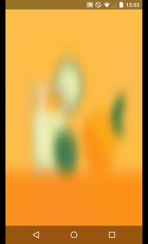

# Dynamic blurred app background demo

A demo app for [a blog post](http://marcin-kozinski.github.io/dynamic-blurred-app-background.html) about making a dynamic app background showing a blurred version of images downloaded from the web. If you run it on your phone, you're going to see this:

